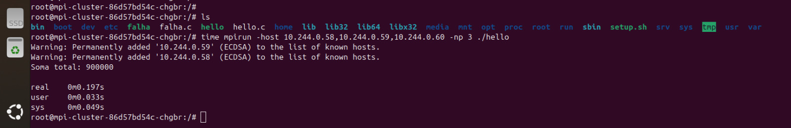
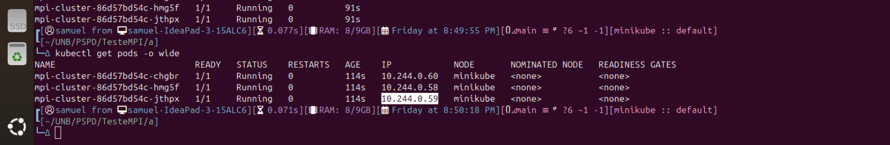
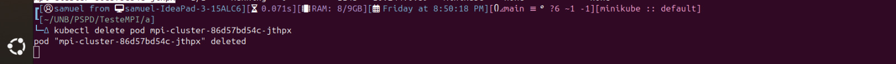
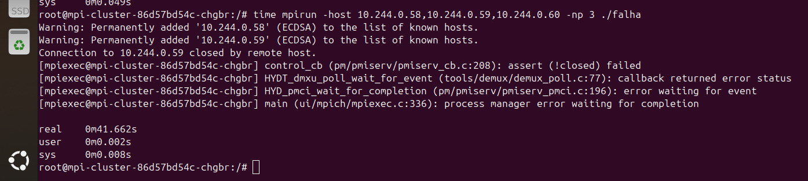

# Universidade de Brasília
## Programação para Sistemas Paralelos e Distribuídos
### Projeto Final - Kubernetes

#### Alunos
- Breno Henrique de Souza - 202015984
- Giulia Domingues de Alcantara - 180121308
- Samuel Alves Sato - 200069322
- Valderson Pontes da Silva Junior - 190020521

# Introdução
O avanço da computação em nuvem e o uso crescente de contêineres têm impulsionado a adoção de tecnologias como o Kubernetes, que se tornou uma plataforma essencial para a orquestração de aplicações distribuídas. Neste contexto, o presente projeto busca explorar as capacidades de computação paralela e distribuída do Kubernetes, testando seu desempenho e tolerância a falhas em diferentes cenários.

O objetivo principal é avaliar o comportamento do Kubernetes em um ambiente de cluster self-hosted, composto por um nó mestre e pelo menos dois nós workers. Além disso, serão realizados experimentos integrando o Kubernetes com tecnologias complementares, como Apache Spark e bibliotecas MPI/OMP, analisando como cada abordagem impacta a escalabilidade, a resiliência e a eficiência do processamento distribuído.

A execução do projeto envolve a instalação e configuração do cluster Kubernetes, a implementação de uma aplicação de teste e a condução de experimentos que simulam falhas e variações na carga de trabalho. A partir dos resultados obtidos, será possível avaliar os benefícios e desafios do uso do Kubernetes para computação paralela e distribuída, bem como sua integração com outras tecnologias.

#### Metodologia
Para a realização da atividade proposta, o grupo se organizou de forma a seguir o roteiro do trabalho final. No primeiro encontro, foram definidas as responsabilidades de cada membro e o planejamento das etapas do trabalho. Foram realizados encontros diário para o desenvolvimento do trabalho. Cada reunião resultou em decisões concretas sobre a execução das atividades, garantindo a divisão equilibrada do trabalho e o cumprimento dos prazos estabelecidos. O grupo foi subdividido logicamente em 2 para esse trabalho, onde um cuidou das configurações do kubernetes e outro do desenvolvimento da aplicação

# Cluster Kubernetes
## O que é 
Kubernetes é uma plataforma de código aberto, portátil e extensível para gerenciar cargas de trabalho e serviços conteinerizados. Ele facilita a configuração declarativa e a automação, permitindo que aplicações sejam executadas de forma eficiente e escalável. Com um ecossistema em rápido crescimento, Kubernetes oferece suporte a diversas ferramentas e serviços que auxiliam na administração e no funcionamento do cluster. [11]

Um cluster Kubernetes é formado por um conjunto de máquinas que trabalham juntas para executar aplicações em contêineres. Ele é composto por um plano de controle, responsável por gerenciar o cluster, manter o estado desejado e agendar workloads, e pelos nós workers, que são responsáveis por executar os contêineres e as aplicações. Dentro dos nós, os pods representam a menor unidade implantável e podem conter um ou mais contêineres, garantindo flexibilidade na execução das cargas de trabalho. [11]

Além da estrutura básica, Kubernetes possui mecanismos para gerenciar a comunicação entre as aplicações por meio de serviços, balanceamento de carga e recursos de rede. Também oferece opções para armazenamento, permitindo que os dados sejam mantidos de forma persistente ou temporária conforme a necessidade das aplicações. Para garantir a segurança, Kubernetes disponibiliza diversas configurações e políticas que ajudam a proteger os workloads e a definir boas práticas de administração do cluster. [11]

Em resumo, Kubernetes é uma solução poderosa para automatizar a implantação, escala e operação de aplicativos baseados em contêineres. Ele simplifica a gestão da infraestrutura, garantindo eficiência, flexibilidade e alta disponibilidade para aplicações modernas. [11]


## Passo a Passo de Montagem 
1. Criação do script de instalação básica do Kubernetes `common.sh`:
  - O script contém todos os comandos utilizados pelo grupo para a instalação das configurações;
  - Ele está disponível na pasta do projeto;
  - Esse arquivo deve ser executado nas três máquinas: master, worker01 e worker 02, com o comando:
    ```bash
    sudo ./common.sh
    ```
  - Para fazer com que o swapoff tem q tá desligado pros nós do cluster conectarem, dê o comando:
    ```bash
    sudo nano /etc/fstab
    ```
    E comente a linha do swap
2. Criação do script de configuração da master `master.sh`:
  - O script contém todos os comandos utilizados pelo grupo para a configuração da máquina master;
  - Ele está disponível na pasta do projeto;
  - Esse arquivo deve ser executado apenas na master, com o seguinte comando:
    ```bash
    bash ./master.sh
    ```
  - Após, rode:
    ```bash
    kubectl get po -n kube-system
    kubectl get --raw='/readyz?verbose'
    kubeadm token create --print-join-command
    ```
  O último comando retornará algo como:
  
        kubeadm join 10.0.0.10:6443 --token <TOKEN>  --discovery-token-ca-cert-hash <HASH SHA-256 >
3. Criação dos nós workers:
  - Em ambos os workrs, rode o comando que recebeu no print:
    * Obs: Recomenda-se a utilização de sudo para prevenir erros de permissão
    ```bash
    sudo kubeadm join 10.0.0.10:6443 --token <TOKEN>  --discovery-token-ca-cert-hash <HASH SHA-256 >
    ```
 4. Criação de labels:
  - No nó master rode:
    ```bash
    kubectl get nodes
    kubectl label node <nome-do-node> node-role.kubernetes.io/worker=worker
    ```
  5. Ativação dos metrics:

- Primeiro entre na pasta manifests:

  bash
  cd ../manifests
  

- Após, dê os comandos:
  bash
  kubectl apply -f metrics-server.yaml
  kubectl top nodes
  

6. Criando app nginx

- Ainda na pastas manifests de o comando:
  bash
    kubectl apply -f sample-app.yaml
  
- Entre na URL: <IP DA MAQUINA>:32000
## Criação do Dashboard de Monitoramento:
- Instalação do `helm`:
  ```bash
  curl https://get.helm.sh/helm-v3.12.0-linux-amd64.tar.gz -o helm-v3.12.0-linux-amd64.tar.gz
  ```
- Adição do repositório kubernetes-dashboard
  ```bash
  helm repo add kubernetes-dashboard https://kubernetes.github.io/dashboard/
  ```
- Deploy de uma Release do Helm chamada 'kubernetes-dashboard' utilizando o chart do kubernetes-dashboard:
  ```bash
  helm upgrade --install kubernetes-dashboard kubernetes-dashboard/kubernetes-dashboard --create-namespace --namespace kubernetes-dashboard
  ```
- Habilitar o acesso ao Dashboard:
  ```bash
  kubectl -n kubernetes-dashboard port-forward svc/kubernetes-dashboard-kong-proxy 8443:443
  ```
  * Caso esteja usando VM na maquina host colocar o seguinte comando:
    ```bash
    ssh -L 8443:localhost:8443 vagrant@<ip da maquina>
    ```
- Acesse o link disponibilizado do dashboard via: [https://localhost:8443/](https://localhost:8443/)
- Criação do Usuário Admin `dashboard-adminuser.yaml`:
  - Criar o arquivo:
    ```bash
    nano dashboard-adminuser.yaml
    ```
  - Adicionar o conteúdo:
    ```bash
    apiVersion: v1
    kind: ServiceAccount
    metadata:
      name: admin-user
      namespace: kubernetes-dashboard
    apiVersion: rbac.authorization.k8s.io/v1
    kind: ClusterRoleBinding
    metadata:
      name: admin-user
    roleRef:
      apiGroup: rbac.authorization.k8s.io
      kind: ClusterRole
      name: cluster-admin
    subjects:
    - kind: ServiceAccount
      name: admin-user
      namespace: kubernetes-dashboard
    ```
    Se não funcionar:
    ```bash
    apiVersion: v1
    kind: ServiceAccount  
    metadata:
      name: admin-user
      namespace: kubernetes-dashboard
    ---
    apiVersion: rbac.authorization.k8s.io/v1
    kind: ClusterRoleBinding
    metadata:
      name: admin-user
    roleRef:
      apiGroup: rbac.authorization.k8s.io
      kind: ClusterRole
      name: cluster-admin
    subjects:
    - kind: ServiceAccount
      name: admin-user
      namespace: kubernetes-dashboard
    ```
  - Aplique as mudanças:
    ```bash
    kubectl apply -f dashboard-adminuser.yaml
    ```
- Gere o Token de Autenticação:
  ```bash
  kubectl -n kubernetes-dashboard create token admin-user
  ```
    * Obs: O dashbaord foi criado utilizando-se a documentação oficial do Kubernetes [12].

## Testes e Resultados
### 1. Teste de Alta Disponibilidade e Orquestração
- Verificando os pods criados:

- Simulando falha no pod:

- Kubernetes recriando o pod automaticamente:

- Visualização no kubernetes dashboard:

- Simulando a queda de um nó worker:

- Resultado no dashboard:

- O pod ficou pendente:

  - Obs: Caso o pod ainda esteja pendente e suba o worker de volta ele volta ao estado de running
- Criou um novo pod no worker:

  - Obs: Caso o pod tenha sido terminado, ele não cria o pod no worker ao subir de novo
- O pod foi deletado:

- CPU ao longo do tempo:


### 2. Teste de Escalabilidade e Escalonamento:
- Criando mais replicas:

- Analisando criação:

- Criou com um nó ficando pendente:

- No dashboard:

- Erro apresentado no nó:

- Teste de carga:

  - Comando no terminal windows: while ($true) { curl http://10.0.0.11:32000 } 
- Antes de usar hpa: kubectl autoscale deployment nginx --cpu-percent=50 --min=1 --max=5
- Quando chega a 50% cria novas replicas:


- Uso da cpu aumentando:


## Spark com Kubernetes
### Como funciona
A integração do Apache Spark com Kubernetes permite executar cargas de trabalho distribuídas de processamento de dados em um cluster Kubernetes, aproveitando seus recursos de escalabilidade e orquestração.


### Passo a Passo de Montagem 
1. Instale o Apache Spark dentro da sua master:
  - Pré requisitos: [JAVA open SDK 11; Docker instalado](#anexos)
  - Rode os seguintes comandos:
    ```bash
    sudo mkdir -p /opt/spark
    ls /opt/
    sudo wget https://downloads.apache.org/spark/spark-3.5.4/spark-3.5.4-bin-hadoop3.tgz -P /opt/spark
    sudo tar -xvf /opt/spark/spark-3.5.4-bin-hadoop3.tgz -C /opt/spark --strip-components=1
    ls /opt/spark/bin/spark-submit
    export SPARK_HOME=/opt/spark
    export PATH=$PATH:$SPARK_HOME/bin 
    source ~/.bashrc
    spark-submit --version
    ```  
2. Baixe a imagem mais recente do Spark:
  ```bash
  sudo docker pull apache/spark:latest
  ```
4. Descubra o ip da sua master:
  ```bash
  kubectl cluster-info
  ```
5. Descubra o local do arquivo .jar:
  ```bash
  ls /opt/spark/examples/jars/
  ```
6. Execute o job Spark:
  ```bash
/opt/spark/bin/spark-submit \
    --master k8s://<IP DA MASTER>:<PORTA DA MASTER> \
    --deploy-mode cluster \
    --name spark-test \
    --class org.apache.spark.examples.SparkPi \
    --conf spark.executor.instances=3 \
    --conf spark.kubernetes.container.image=apache/spark:latest \
    local:///opt/spark/examples/jars/spark-examples_<VERSAO DO JAR>
  ```
  - Esse comando submete um job Spark ao Kubernetes para calcular uma aproximação do número π. Se bem sucedido ele retornará:
    ```bash
    INFO DAGScheduler: Job 0 finished: reduce at SparkPi.scala:36, took 20.123 s
    Pi is roughly 3.14159265358979
    ```
    
#### MPI/OpenMP com Kubernetes

Foi criado duas aplicações em c para testar a tolerância de falha e performace do kubernetes. A estrutura, pastas e arquivos estão no /mpi. A fim de estudas a aplicação foi desenvolvido testes com docker compose para melhor desenvolvimento.

No arquivo [README](./mpi/REAMDE.md) apresenta como configurar e realizar os testes.

O projeto consiste nos seguintes arquivos principais:

- `Dockerfile` → Define a imagem base para os containers MPI.
- `setup.sh` → Script que configura o ambiente MPI dentro dos containers.
- `docker-compose.yaml` → Configuração original para Docker Compose.
- `mpi-hostfile-configmap.yaml` → Gera dinamicamente o arquivo de hosts (`hostfile`) para a execução do MPI.
- `mpi-deployment.yaml` → Configura os pods MPI no Kubernetes e expõe as portas SSH.

##### Como funciona
A integração do Spark com o Kubernetes...
##### Passo a Passo de Montagem 

##### Testes e Resultados

O roteiro de testes e como foi realizado se encontra no [README](./mpi/REAMDE.md)
###### 1. Teste de performaca

Resultados Apresentdos:



###### 2. Teste de tolerância de erro

Resultados Apresentados:






### Cloud Native
### Introdução 
#### Contextualização do tema Cloud Native  
A computação em nuvem revolucionou a forma como as organizações desenvolvem, implantam e gerenciam aplicações. Nesse cenário, o conceito de *Cloud Native* emerge como uma abordagem que maximiza os benefícios oferecidos pelo modelo de entrega em nuvem. Aplicações nativas em nuvem são projetadas para explorar ao máximo as características da computação em nuvem, como escalabilidade, resiliência e flexibilidade. Elas podem ser construídas utilizando diferentes arquiteturas, incluindo tanto microsserviços quanto monolitos, dependendo dos requisitos específicos e objetivos do negócio. Além disso, essas aplicações frequentemente utilizam contêineres para garantir portabilidade e consistência, sendo orquestradas por plataformas como o Kubernetes.  

### Importância do Cloud Native no cenário atual da computação em nuvem  
A adoção de práticas e tecnologias *Cloud Native* permite que as empresas desenvolvam aplicações mais resilientes e escaláveis, capazes de se adaptar rapidamente às mudanças nas demandas do mercado. Essa abordagem facilita a implementação de atualizações contínuas sem interrupções significativas, promovendo uma experiência aprimorada para os usuários finais. Além disso, ao utilizar arquiteturas modulares, compostas por componentes independentes que podem ser desenvolvidos, implantados e escalados separadamente, e serviços gerenciados, que reduzem a complexidade operacional ao oferecer funcionalidades prontas e otimizadas, as organizações conseguem otimizar recursos, melhorar a eficiência e reduzir custos operacionais.  

#### Objetivo do documento  
Este documento tem como objetivo explorar o conceito de *Cloud Native*, detalhando seus principais elementos e características. Serão discutidos os impactos dessa abordagem nas práticas de *DevOps*, incluindo a influência de contêineres e tecnologias de computação em cluster, com destaque para o papel do Kubernetes. Além disso, será realizada uma comparação entre arquiteturas de aplicações baseadas em microsserviços e monolíticas, analisando o futuro das aplicações no paradigma *Cloud Native*. Por fim, será abordada a importância do monitoramento e da observabilidade em ambientes *Cloud Native*, apresentando desafios comuns e ferramentas de suporte.  

### Conceitos Fundamentais do Cloud Native
#### Definição de Cloud Native  
O termo *Cloud Native* refere-se a uma abordagem de desenvolvimento e operação de aplicações que aproveita ao máximo as características e benefícios oferecidos pela computação em nuvem. Isso inclui a utilização de modelos baseados na nuvem para criar e executar aplicativos escaláveis e dinâmicos em ambientes modernos, como nuvens públicas, privadas e híbridas.  

#### Principais elementos e características  
As aplicações *Cloud Native* são caracterizadas por vários elementos e práticas que as tornam distintas:  
- **Contêineres**: Empacotam o código e suas dependências em unidades portáteis e consistentes, garantindo que as aplicações funcionem de maneira uniforme em diferentes ambientes.  
- **Microsserviços**: Arquitetura que divide a aplicação em serviços pequenos e independentes, cada um responsável por uma funcionalidade específica, facilitando o desenvolvimento, a implantação e a escalabilidade.  
- **DevOps e Integração Contínua/Entrega Contínua (CI/CD)**: Práticas que promovem a colaboração entre equipes de desenvolvimento e operações, automatizando processos de construção, teste e implantação para acelerar a entrega de software.  
- **Infraestrutura Imutável**: Servidores e componentes de infraestrutura são substituídos em vez de modificados, garantindo consistência e facilitando a recuperação em caso de falhas.  
- **Orquestração e Automação Dinâmica**: Uso de ferramentas como o Kubernetes para gerenciar automaticamente a implantação, escalabilidade e operação de contêineres, otimizando a utilização de recursos.  

#### Arquitetura e princípios fundamentais  
A arquitetura *Cloud Native* baseia-se em princípios que promovem a eficiência e a resiliência das aplicações:  
- **Desenvolvimento de Aplicações como Serviços Independentes**: Cada serviço é desenvolvido, implantado e escalado de forma autônoma, permitindo atualizações e manutenção sem impactar o sistema como um todo.  
- **Automação de Processos**: Desde a provisão de infraestrutura até a implantação de código, a automação reduz erros humanos e aumenta a eficiência operacional.  
- **Observabilidade**: Implementação de monitoramento, logging e tracing para fornecer insights detalhados sobre o comportamento da aplicação, facilitando a identificação e resolução de problemas.  
- **Resiliência e Recuperação de Falhas**: Projetar sistemas que possam detectar, isolar e se recuperar automaticamente de falhas, minimizando o impacto nos usuários finais.  

Esses princípios e elementos combinados permitem que as organizações desenvolvam e operem aplicações que são não apenas robustas e escaláveis, mas também ágeis e alinhadas às necessidades dinâmicas dos negócios modernos.  

### O Papel do Devops e a Influência das Tecnologias Cloud Native
#### Adoção de Contêineres e sua Influência no DevOps  
A integração de contêineres no ambiente *DevOps* tem transformado significativamente as práticas de desenvolvimento e operações. Contêineres permitem empacotar aplicações e suas dependências em unidades portáteis e consistentes, garantindo que o software funcione uniformemente em diferentes ambientes. Essa consistência reduz discrepâncias entre ambientes de desenvolvimento, teste e produção, facilitando a colaboração entre equipes e acelerando o ciclo de entrega de software. Ferramentas como *Docker* têm sido fundamentais nesse processo, proporcionando uma plataforma robusta para criação e gerenciamento de contêineres.  

#### Computação em Cluster e sua Relação com DevOps  
A computação em cluster, especialmente quando combinada com orquestradores de contêineres como o *Kubernetes*, aprimora as práticas de *DevOps* ao fornecer uma infraestrutura escalável e resiliente. Clusters permitem que aplicações sejam distribuídas em múltiplos nós, garantindo alta disponibilidade e balanceamento de carga eficiente. O *Kubernetes* automatiza a implantação, o dimensionamento e o gerenciamento de aplicações conteinerizadas, permitindo que as equipes de *DevOps* gerenciem a infraestrutura e as configurações de maneira consistente em vários ambientes.  

### Arquitetura de Aplicações Cloud Native
A arquitetura de aplicações *Cloud Native* evoluiu para atender às demandas de escalabilidade, flexibilidade e manutenção no desenvolvimento de software moderno. Duas abordagens principais se destacam: a arquitetura monolítica e a de microsserviços.  

#### Comparação entre Arquiteturas Monolíticas e Microsserviços  
Na arquitetura monolítica, todas as funcionalidades de uma aplicação são integradas em um único bloco de código. Isso significa que a interface do usuário, a lógica de negócios e o acesso a dados estão interligados e dependentes uns dos outros. Embora essa abordagem possa simplificar o desenvolvimento inicial e a implantação, à medida que a aplicação cresce, torna-se mais complexa e difícil de manter.  

Em contraste, a arquitetura de microsserviços divide a aplicação em componentes menores e independentes, cada um responsável por uma funcionalidade específica. Esses serviços comunicam-se entre si por meio de APIs bem definidas, permitindo que sejam desenvolvidos, implantados e escalados de forma autônoma.  

#### Benefícios e Desafios dos Microsserviços no Contexto Cloud Native  
A adoção de microsserviços no contexto *Cloud Native* oferece benefícios como escalabilidade, permitindo que cada serviço seja dimensionado de forma independente conforme a demanda, e agilidade no desenvolvimento, já que equipes podem trabalhar simultaneamente em diferentes serviços, acelerando a entrega de funcionalidades. 

### Monitoramento e Observabilidade em Cloud Native
Em ambientes *Cloud Native*, o monitoramento e a observabilidade são cruciais para garantir a performance, a disponibilidade e a resiliência das aplicações. Com a crescente adoção de arquiteturas de microsserviços e infraestruturas dinâmicas, a complexidade dos sistemas aumenta, tornando indispensável uma visão abrangente e detalhada de todos os componentes envolvidos.  

#### Importância do Monitoramento em Ambientes Cloud Native  
O monitoramento em ambientes *Cloud Native* permite que as equipes de TI acompanhem, em tempo real, o desempenho e o estado de saúde das aplicações e da infraestrutura subjacente. Essa prática é essencial para a detecção proativa de problemas, possibilitando respostas rápidas a incidentes e minimizando o impacto nos usuários finais. Além disso, o monitoramento contínuo auxilia na otimização de recursos, garantindo que as aplicações operem de maneira eficiente e econômica.  

#### Principais Desafios e Problemas Enfrentados  
A transição para arquiteturas *Cloud Native* apresenta desafios específicos no que diz respeito ao monitoramento e à observabilidade. A fragmentação de aplicações em múltiplos microsserviços pode dificultar a rastreabilidade e a compreensão do fluxo de dados. Além disso, ambientes que escalam automaticamente podem gerar volumes massivos de dados de telemetria, tornando desafiador o processamento e a análise em tempo hábil. A coexistência de diversas ferramentas, linguagens e plataformas requer soluções de monitoramento que integrem e correlacionam dados de fontes distintas de maneira coesa.  

#### Ferramentas e Técnicas para Observabilidade e Monitoramento  
Para enfrentar os desafios de monitoramento e observabilidade em ambientes *Cloud Native*, diversas ferramentas e técnicas têm sido adotadas.  
- **Prometheus**: Uma solução de código aberto que coleta e armazena métricas em séries temporais, permitindo consultas e alertas em tempo real, sendo amplamente utilizada para monitorar a performance de aplicações e infraestrutura.  
- **Grafana**: Uma plataforma de análise e monitoramento que permite a visualização de métricas por meio de dashboards interativos, integrando-se facilmente com diversas fontes de dados.  
- **Elastic Observability**: Parte do *Elastic Stack*, oferece soluções para monitoramento unificado de logs, métricas e rastreamentos, facilitando a detecção e resolução de problemas em ambientes *Cloud Native*.  
- **eBPF (Extended Berkeley Packet Filter)**: Tecnologia que permite a execução de programas no kernel do sistema operacional, proporcionando monitoramento avançado e coleta de métricas com baixo overhead. Empresas como *Meta*, *Google* e *Netflix* utilizam *eBPF* para aprimorar a observabilidade de seus sistemas.  

#### Exemplos de Soluções Utilizadas na Indústria  
Empresas líderes em tecnologia têm adotado soluções avançadas de monitoramento e observabilidade para aprimorar a eficiência e a confiabilidade de suas infraestruturas.  
- **Netflix**: Utiliza *eBPF* para obter visibilidade em nível de kernel, permitindo monitoramento detalhado e diagnóstico preciso de desempenho em sua infraestrutura de streaming. Desenvolveu o *bpftop*, uma ferramenta de código aberto que fornece uma visão em tempo real dos programas *eBPF* em execução.  
- **Meta**: Implementou o *eBPF* por meio de seu balanceador de carga, o *Katran*, que gerencia eficientemente o tráfego para plataformas como o *Facebook*. O *Katran* é uma biblioteca em *C++* que utiliza a infraestrutura *XDP* do kernel Linux para fornecer um plano de encaminhamento de alto desempenho para balanceamento de carga de camada 4.  

Esses exemplos demonstram a importância de investir em ferramentas e práticas de monitoramento e observabilidade para manter a eficiência e a confiabilidade de aplicações em ambientes *Cloud Native*.  

#### Conclusão 
##### Sobre o Experimento

##### Percepção dos Estudantes

##### Autoavaliação 

##### Referências
[1] GOOGLE CLOUD. What is Cloud Native? Disponível em: [https://cloud.google.com/learn/what-is-cloud-native](https://cloud.google.com/learn/what-is-cloud-native). Acesso em: 19 fev. 2025.  
[2] DYNATRACE. Cloud Native Architecture. Disponível em: [https://www.dynatrace.com/knowledge-base/cloud-native-architecture](https://www.dynatrace.com/knowledge-base/cloud-native-architecture). Acesso em: 19 fev. 2025.  
[3] AWS. What is Cloud Native? Disponível em: [https://aws.amazon.com/what-is/cloud-native](https://aws.amazon.com/what-is/cloud-native). Acesso em: 20 fev. 2025.  
[4] CURSA. Containers e a sua Relação com DevOps: Docker e Kubernetes. Disponível em: [https://cursa.app/pt/pagina/containers-e-a-sua-relacao-com-devops-docker-e-kubernetes](https://cursa.app/pt/pagina/containers-e-a-sua-relacao-com-devops-docker-e-kubernetes). Acesso em: 20 fev. 2025.  
[5] SERVICE. Como o Kubernetes Potencializa os Benefícios do DevOps. Disponível em: [https://service.com.br/como-o-kubernetes-potencializa-os-beneficios-do-devops/](https://service.com.br/como-o-kubernetes-potencializa-os-beneficios-do-devops/). Acesso em: 21 fev. 2025.  
[6] MARTITEC. Principais Benefícios do Kubernetes. Disponível em: [https://martitec.com.br/principais-beneficios-do-kubernetes/](https://martitec.com.br/principais-beneficios-do-kubernetes/). Acesso em: 21 fev. 2025.  
[7] AWS. The Difference Between Monolithic and Microservices Architecture. Disponível em: [https://aws.amazon.com/pt/compare/the-difference-between-monolithic-and-microservices-architecture](https://aws.amazon.com/pt/compare/the-difference-between-monolithic-and-microservices-architecture). Acesso em: 21 fev. 2025.  
[8] MICROSOFT. Observability Patterns. Disponível em: [https://learn.microsoft.com/pt-pt/dotnet/architecture/cloud-native/observability-patterns](https://learn.microsoft.com/pt-pt/dotnet/architecture/cloud-native/observability-patterns). Acesso em: 21 fev. 2025.  
[9] NETFLIX TECH BLOG. Announcing Bpftop: Streamlining eBPF Performance Optimization. Disponível em: [https://netflixtechblog.com/announcing-bpftop-streamlining-ebpf-performance-optimization-6a727c1ae2e5](https://netflixtechblog.com/announcing-bpftop-streamlining-ebpf-performance-optimization-6a727c1ae2e5). Acesso em: 19 fev. 2025.  
[10] FACEBOOK ENGINEERING. Open-Sourcing Katran: A Scalable Network Load Balancer. Disponível em: [https://engineering.fb.com/2018/05/22/open-source/open-sourcing-katran-a-scalable-network-load-balancer](https://engineering.fb.com/2018/05/22/open-source/open-sourcing-katran-a-scalable-network-load-balancer). Acesso em: 20 fev. 2025.  
[11] KUBERNETES. Conceitos. Disponível em: [https://kubernetes.io/docs/concepts/](https://kubernetes.io/docs/concepts/). Acesso em: 20 fev. 2025.
[12] KUBERNETES. Dashboard. Disponível em: [https://kubernetes.io/docs/tasks/access-application-cluster/web-ui-dashboard/](https://kubernetes.io/docs/tasks/access-application-cluster/web-ui-dashboard/). Acesso em: 20 fev. 2025. 

#### Anexos
##### Manual de instalação das VMs 
- Pré-Requisitos:
  - [Virtual Box](https://www.virtualbox.org/wiki/Downloads)
  - [Vagrant](https://developer.hashicorp.com/vagrant/install)
- Após baixar o Vagrant, execute:
    ```bash
      mkdir apache-vm && cd apache-vm
      vagrant init bento/ubuntu-22.04 
    ```
  - Modifique o Vagrantfile para:
    ```bash
        Vagrant.configure("2") do |config|
          config.vm.provision "shell", inline: <<-SHELL
              apt-get update -y
              echo "10.0.0.10  master-node" >> /etc/hosts
              echo "10.0.0.11  worker-node01" >> /etc/hosts
              echo "10.0.0.12  worker-node02" >> /etc/hosts
          SHELL
          
          config.vm.define "master-spark" do |master|
            master.vm.box = "bento/ubuntu-22.04"
            master.vm.hostname = "master-node"
            master.vm.network "private_network", ip: "10.0.0.10"
            master.vm.provider "virtualbox" do |vb|
                vb.memory = 8192 
                vb.cpus = 4
            end
          end
        
          (1..2).each do |i|
        
          config.vm.define "node0#{i}-spark" do |node|
            node.vm.box = "bento/ubuntu-22.04"
            node.vm.hostname = "worker-node0#{i}"
            node.vm.network "private_network", ip: "10.0.0.1#{i}"
            node.vm.provider "virtualbox" do |vb|
                vb.memory = 4096
                vb.cpus = 2
            end
          end
          
          end
        end
    ```
  - Após, execute para subir as VMs:
    ```bash
      vagrant up 
    ```
#### Configuração do Java openJDK11
Para instalar o Java openJDK11 execute os seguintes comandos
```bash
  sudo apt update
  sudo apt install openjdk-11-jdk
  java -version
  ```
##### Configuração do Docker no Kubernetes
```bash
  sudo apt update && sudo apt upgrade -y
  sudo apt install -y ca-certificates curl gnupg
  sudo install -m 0755 -d /etc/apt/keyrings
  curl -fsSL https://download.docker.com/linux/ubuntu/gpg | sudo tee /etc/apt/keyrings/docker.asc > /dev/null
  echo "deb [arch=$(dpkg --print-architecture) signed-by=/etc/apt/keyrings/docker.asc] https://download.docker.com/linux/ubuntu $(lsb_release -cs) stable" | sudo tee /etc/apt/sources.list.d/docker.list > /dev/null
  sudo apt update
  sudo apt install -y docker-ce docker-ce-cli containerd.io docker-buildx-plugin docker-compose-plugin
  docker --version
  ```
